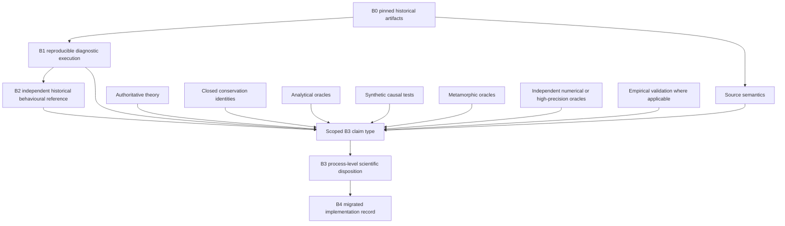

# ANIMO5 evidence DAG reconciliation

Work unit: `ANIMO-GOV02`

Status of this document: governance reconciliation only. It does not admit a corrected legacy process, establish a global B3 baseline, admit B4, or authorize production migration.

## 1. Why this reconciliation is needed

ANIMO5 keeps the B0-B4 labels because they remain useful, but those labels must not be read as one universal serial ladder. They describe different evidence roles. The historical-fidelity question and the scientific-correctness question overlap, but neither subsumes the other.

The authoritative EB01 and B3Q01 documents already contain most of this separation. GOV02 makes the dependency structure explicit at integration-gate level and prevents the current RG02 gate ordering from being misread as `B2 required before any B3`.

GOV02 does not retroactively change the evidence class or qualified status of any earlier work unit.

## 2. Authority reconciled

| Stream | Authoritative branch / head at GOV02 start | Reconciled role |
|---|---|---|
| RG02 | `work/animo-rg02-g5-independent-stream-attachment@5c278152eacc33660f1c5870c7d419b8041b20a9` | integration DAG and gate ownership |
| EB01 | `work/animo-eb01-evidence-baseline-model@52411b9d2d6d80717914bc6642544290a54ded21` | B0-B4 meanings |
| B3Q01 | `work/animo-b3q01-scientific-admission-framework@846e0f4d02a38b9e02cc1419b1ca87e63aaedb54` | scientific admission contract |
| PREP02R | `work/animo-prep02r-historical-reference-recovery@e29aa75f782a17e1cca6b0c2791ba04077e8bde7` | historical-reference acquisition state |
| SYNQ01 | `work/animo-synq01-independent-synthetic-oracles@e1134630b5ff4cded17dfd33ba13881ec3264ae0` | synthetic-oracle taxonomy, currently preparatory/in progress |
| TQ01 | `work/animo-tq01-testcase-qualification@5c43ee16df37a0a1357614fdec527f25e5ca8c16` | testcase/path coverage |
| NQ01 | `work/animo-nq01-numerical-qualification-architecture@e558dff12b127e0662cad62beea7527b42ad89ac` | numerical qualification architecture |
| NQ02 | `work/animo-nq02-tcd019-nonlinear-p-qualification@12e874559d484417cea1ca5d4ef719ea0b359585` | live Class E constraints |
| TS01 | `work/animo-ts01-temporal-semantics@ed12a678cfba19ce851eb2f380e6da3f49203fe4` | source-bound temporal semantics without B2 |
| B3A01 | `work/animo-b3a01-tcd027-class-a-readiness@b2bac82512fef0fa232e759f0c68b472567c11d5` | Class A readiness, explicitly not admission |

Owner-qualified EB01 and B3Q01 documents are not replaced by GOV02. This document is the cross-stream reconciliation layer. RG-owned integration documents consume it.

## 3. Terminology

### Baseline

A pinned condition, artifact set or evidence snapshot. A baseline may be immutable and reproducible without being an independent reference or an oracle.

### Reference

A comparison source that is independent of the result being evaluated for the claim for which it is used.

### Oracle

A source that supplies normative expected behaviour for a bounded claim. Oracle authority is claim-specific. No oracle has universal authority by label alone.

### Historical oracle

B2-type evidence: an independently trusted historical behavioural reference that can answer what the relevant historical implementation did on the exercised path under its qualified environment.

### Scientific oracle

Independent expected-behaviour evidence for a scientific or mathematical claim, for example an analytical solution, closed conservation identity, metamorphic relation, independently implemented numerical calculation, high-precision calculation, or authoritative theory-derived expectation.

Two non-equivalences are permanent:

`historical oracle != scientific truth`

`scientific oracle != proof of historical behaviour`

## 4. B0-B4 remain stable labels

- `B0`: pinned historical artifacts and provenance. B0 establishes identity, not behavioural correctness.
- `B1`: reproducible diagnostic execution. B1 may establish path activation, causality, non-interference, conservation observations and compiler sensitivity. B1 is not an independent historical oracle.
- `B2`: independently trusted historical behavioural reference, scoped to the environment and path actually qualified. B2 establishes historical fidelity evidence, not scientific correctness.
- `B3`: process-scoped qualified scientific legacy disposition produced by explicit reconciliation for a stated claim type.
- `B4`: admitted migrated ANIMO5 implementation baseline. B4 inherits the evidence and uncertainty provenance of its admitted B3 inputs.

## 5. Evidence DAG

The edge `B1 -> B2` is a historical-fidelity track dependency, not a permission to manufacture B2 from B1. B2 must remain independent. Scientific evidence can enter B3 reconciliation through other edges. Which edges are mandatory depends on the claim type and qualification class.

## 6. Mandatory claim typing

Every B3 disposition must declare exactly which question it answers, using one or more explicit atomic claim records rather than an ambiguous combined statement:

- `HISTORICAL_FIDELITY_CLAIM`
- `SCIENTIFIC_CORRECTION_CLAIM`
- `REPRESENTATION_EQUIVALENCE_CLAIM`
- `NUMERICAL_POLICY_CLAIM`
- `PHYSICS_MODEL_CLAIM`

A disposition that mixes claim types must split them when their evidence requirements differ. For example, a correction can be scientifically qualified while its historical behaviour remains unknown. That must not be serialized as a single claim of both correctness and historical fidelity.

## 7. Process-scoped B2 rule

B2 is mandatory when the acceptance statement itself is about historical behaviour. This includes:

1. exact or qualified historical-behaviour preservation;
2. a claim that compiler/runtime semantics match historical Intel behaviour;
3. use of historical output as the acceptance oracle;
4. a historical regression statement for which no other independent historical evidence exists;
5. a `REPRESENTATION_EQUIVALENCE_CLAIM` whose reference is explicitly the historical implementation rather than an already admitted B3 process contract.

Absence of B2 therefore blocks those historical claims. It does not automatically block every independent scientific claim about the same process.

## 8. Scientific B3 without B2

The sole governance route is:

`INDEPENDENT_SCIENTIFIC_ADMISSION_WITH_HISTORICAL_UNCERTAINTY`

It may be considered only after PREP02R reaches `B2_REFERENCE_UNAVAILABLE_AFTER_REASONABLE_ACQUISITION_EFFORT` for the relevant historical reference scope. Difficulty, delay or inconvenience is not enough.

The route requires, at minimum:

- completed and independently reviewable B2 acquisition history and stopping rationale;
- a narrow scientific claim that is independently answerable without historical output;
- authoritative theory, a closed identity, or another strong claim-specific scientific oracle;
- B1 source-bound causal evidence for the targeted path;
- expected difference defined before acceptance evaluation;
- non-interference evidence on unaffected physical state/flux or adjacent processes as applicable;
- path and edge-case coverage appropriate to the class;
- an independent cross-check that does not merely restate the same assumption as the primary oracle;
- independent second-line review;
- permanent historical-uncertainty provenance.

This route has no lower evidence burden than a B2-backed route. For several classes it has a higher burden because historical cross-check evidence is unavailable.

## 9. SYNQ01 evidence classes

The following classes may contribute to scientific qualification after they themselves are qualified for the relevant claim:

- `ANALYTICAL_ORACLE`
- `CONSERVATION_ORACLE`
- `METAMORPHIC_ORACLE`
- `INDEPENDENT_NUMERICAL_ORACLE`
- `HIGH_PRECISION_ORACLE`
- `THEORY_DERIVED_ORACLE`

No member of this list is B2 by virtue of being an oracle. A synthetic case generated from these principles remains scientific/synthetic evidence unless it also has a separately qualified independent historical provenance, in which case the historical artifact, not the synthetic construction, is the B2 source.

SYNQ01 is still an in-progress preparatory stream at the GOV02 authority snapshot. GOV02 therefore adopts its taxonomy, not a blanket assertion that each individual synthetic oracle has already been qualified.

## 10. Class-specific reconciliation

The detailed matrix is in `B2_REQUIREMENT_SCOPE.md` and `integration/animo-governance/B2_REQUIREMENT_MATRIX.csv`.

- Class A can often support a no-B2 scientific correction because a closed accounting identity and unchanged physical state/flux can be independently tested. Synthetic evidence alone is still insufficient.
- Class B can support a no-B2 scientific correction only when the algebra/index/species authority is unambiguous and independently cross-checked with strong path coverage.
- Class C cannot infer missing physical state merely from mass closure. State ontology, phase ownership, initialization, restart and transfer semantics need independent theory/state authority.
- Class D must distinguish historical representation equivalence, which is B2-dependent, from B3-to-B4 representation equivalence, which can use the admitted B3 process contract while inheriting its historical uncertainty.
- Class E requires numerical formulation authority, convergence, precision/discretization evidence and independent numerical review. A smaller residual or improved mass closure is not correctness.
- Class F is physics/model evolution. B2 may characterize history but cannot authorize new physics. It requires separate scientific-model governance and is not admitted as a legacy correction merely by this route.

## 11. RG02 gate reconciliation

G6 remains the B2 historical-fidelity gate. GOV02 changes its scope interpretation, not its evidence burden.

G7 remains per-discrepancy/process B3 qualification. G7 may receive a process-level input either from a relevant B2-backed reconciliation path or from the strict historical-uncertainty route. A G7 disposition that makes a historical-fidelity claim still depends on G6/B2.

Thus:

- no-B2 process-level scientific admission, if ever completed, does not mark G6 as passed;
- whole-model historical-equivalence claims remain B2-dependent;
- architecture qualification must consume the exact B3 process scope plus its uncertainty markers;
- B4 composition cannot upgrade historical status from unknown to equivalent;
- production migration remains downstream of existing architecture, composition and release gates.

## 12. Uncertainty propagation

A B3 scientific disposition without B2 must persist at least:

`historical_behaviour_status = UNKNOWN`

`historical_reference_status = UNAVAILABLE_AFTER_REASONABLE_ACQUISITION_EFFORT`

and the evidence scope and acquisition record that justify those values.

These markers propagate to:

- B3 composition;
- historical and regression claim wording;
- B4 migration/equivalence records;
- release documentation;
- later comparison work.

If a qualified B2 reference is recovered later, historical fidelity is reopened as a new comparison question. The earlier scientific disposition is not silently rewritten, and later historical agreement or disagreement is recorded explicitly.

## 13. Current PREP02R state

At the GOV02 snapshot PREP02R has prepared a targeted archival request but records `external_request_sent=false`. Therefore the only valid GOV02 closure classification is:

`B2_ACQUISITION_STILL_ACTIVE`

The historical-uncertainty route is not currently activated by PREP02R. B3A01 independently confirms the same fail-closed situation for TCD-027 readiness.

## 14. No silent relaxation

The policy is not:

> if B2 is missing, use synthetic tests.

The policy is:

> if B2 is demonstrably unavailable after a documented reasonable acquisition effort, a narrowly scoped scientific claim may be considered through a stricter independently supported route while historical behaviour remains explicitly unknown.

That distinction is machine-validated by GOV02.
