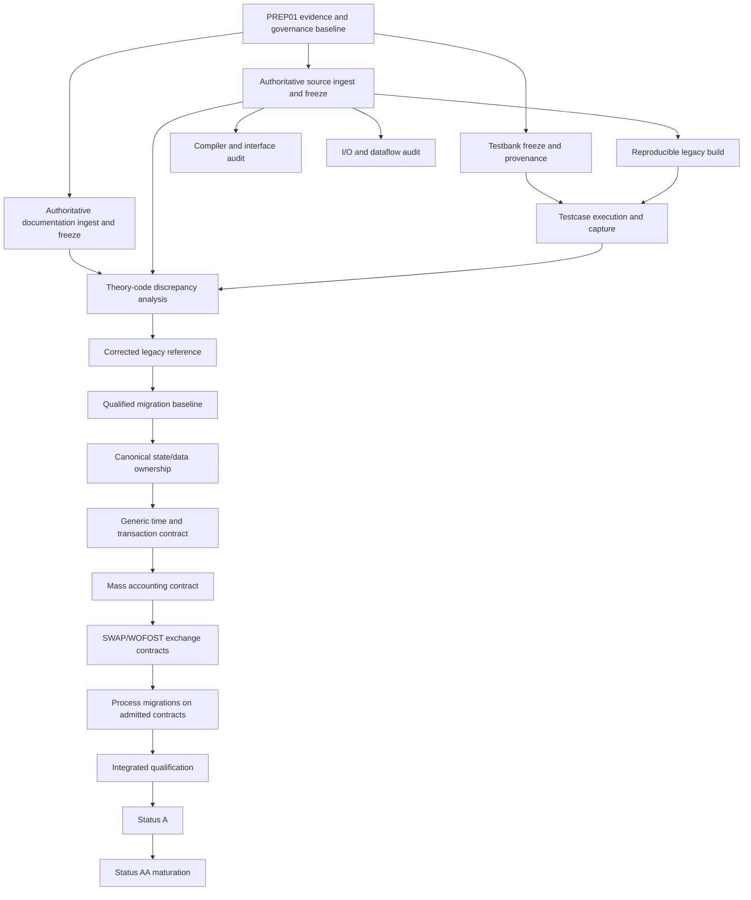

# Initial ANIMO5 migration dependency DAG

This is a first dependency map, not an authorization to start production migration.

## Parallel candidates after missing evidence is ingested

- documentation inventory/reconciliation preparation;
- compiler/interface audit tooling;
- testcase harness development;
- process/dataflow inventory;
- Status A/AA gap analysis.

## Serial shared-semantic gates

- source freeze before behavioural correction;
- corrected reference before migration qualification;
- canonical state ownership before broad process migration;
- time/transaction semantics before coupled trial execution;
- mass accounting before coupled qualification;
- shared exchange interfaces before SWAP/WOFOST integration.
