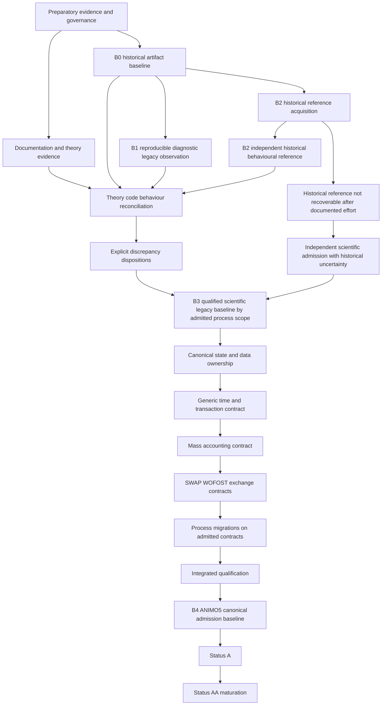

# ANIMO5 migration dependency DAG

This dependency map is not an authorization to start production migration.

Canonical baseline semantics are defined in:

`docs/governance/ANIMO5_EVIDENCE_BASELINE_MODEL.md`

The earlier use of `B0` for a reproducible build is retired. `B0` now consistently means the immutable historical artifact baseline, matching the project's controlled B0 retention terminology.

## Meaning of the graph

B0 establishes identity and provenance, not correctness.

B1 provides reproducible diagnostic observation, not independent historical truth.

B2 provides independent historical behaviour where it can be recovered. B2 does not automatically establish scientific correctness.

B3 is constructed by explicit reconciliation and discrepancy disposition. It may be established incrementally by process scope, but a process cannot be migrated merely because a B1 diagnostic run exists.

B4 is the first admitted modern ANIMO5 canonical baseline within the qualified scope.

## Historical-reference fallback

The fallback path from failed B2 acquisition to B3 is deliberately stricter than ordinary behavioural comparison.

It is allowed only after a documented reasonable historical-reference acquisition effort and requires the evidence contract defined for `INDEPENDENT_SCIENTIFIC_ADMISSION_WITH_HISTORICAL_UNCERTAINTY`.

This fallback does not authorize poorly documented physics changes, arbitrary tolerances or broad numerical-policy changes.

## Parallel candidates before B3 production admission

The following may proceed when ownership is disjoint:

- documentation inventory and revision reconciliation;
- compiler and interface audit tooling;
- testcase harness development;
- B1 diagnostic execution and causal probes;
- B2 historical reference recovery;
- process and dataflow inventory;
- conserved-state and transfer-ledger audit;
- corrected-legacy qualification-case preparation without correction admission;
- GHGMais provenance recovery;
- Status A/AA gap analysis.

## Serial shared-semantic gates

- B0 source identity before behavioural correction claims;
- explicit B3 admission strategy for a process before production migration of that process;
- canonical state ownership before broad process migration;
- time and transaction semantics before coupled trial execution;
- mass accounting before coupled qualification;
- shared exchange interfaces before SWAP/WOFOST integration;
- integrated qualification before B4 admission;
- B4 before Status A claims for migrated production scope.

The project may prepare B3 evidence while B2 acquisition is open. It may not relabel B1 as B2 or B3 to bypass the reference problem.

## RG02 ownership note

From ANIMO-RG02 onward this cross-stream migration DAG is owned by the RG governance series. Evidence, theory, numerical, B3 and architecture work units may propose changes, but parallel branches must not independently replace this file.

The RG02 repository-convergence DAG is separately recorded in `docs/governance/ANIMO_CANONICAL_INTEGRATION_DAG.md`. Repository convergence does not bypass any scientific gate shown above.
