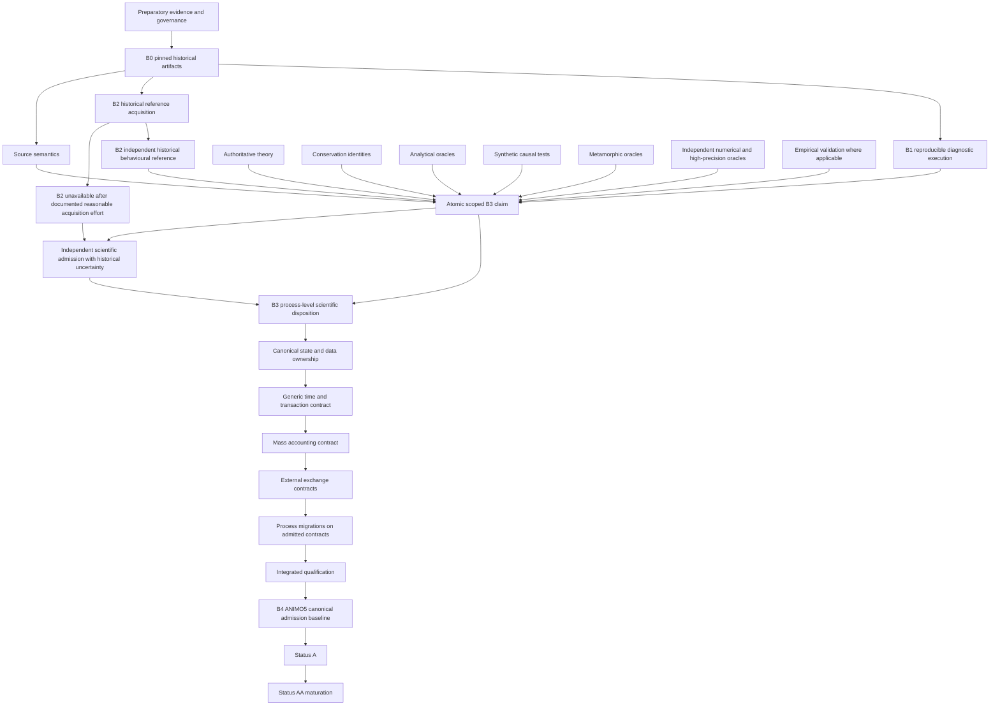

# ANIMO5 migration dependency DAG

This dependency map is not an authorization to start production migration.

Canonical B0-B4 baseline semantics remain defined by EB01 in `docs/governance/ANIMO5_EVIDENCE_BASELINE_MODEL.md`. ANIMO-GOV02 reconciles the cross-stream dependency interpretation without replacing EB01 ownership.

## Evidence DAG, not a universal ladder

The historical-fidelity track remains:

`B0 -> B1 -> B2`

This does not mean B1 becomes B2. B2 remains an independent historical reference.

The scientific-qualification track can receive source semantics, authoritative theory, conservation identities, analytical oracles, synthetic causal tests, metamorphic tests, independent numerical/high-precision calculations and empirical validation where applicable. These sources do not become B2 merely because they are independent scientific oracles.

`historical oracle != scientific truth`

`scientific oracle != proof of historical behaviour`

## Claim-scoped B2 requirement

Every B3 disposition must declare its claim type:

- `HISTORICAL_FIDELITY_CLAIM`
- `SCIENTIFIC_CORRECTION_CLAIM`
- `REPRESENTATION_EQUIVALENCE_CLAIM`
- `NUMERICAL_POLICY_CLAIM`
- `PHYSICS_MODEL_CLAIM`

B2 is mandatory for historical-fidelity claims and for representation-equivalence claims whose reference is historical behaviour. B2 is also mandatory when a historical output is used as the acceptance oracle or when compiler/runtime behaviour is claimed to match the historical Intel environment.

A scientific correction claim can only proceed without B2 through `INDEPENDENT_SCIENTIFIC_ADMISSION_WITH_HISTORICAL_UNCERTAINTY`, after documented reasonable B2 acquisition has genuinely concluded without a usable reference. The evidence burden is not lower and historical behaviour remains unknown.

## Historical-reference fallback

The fallback route is governed by:

- `docs/governance/HISTORICAL_UNCERTAINTY_ADMISSION_POLICY.md`;
- `docs/governance/PREP02R_BOUNDED_ACQUISITION_CLOSURE.md`;
- `docs/governance/B2_REQUIREMENT_SCOPE.md`.

It requires independent scientific authority, B1 causality, predeclared expected difference, non-interference, path coverage, an independent cross-check and second-line review. It is not activated by difficulty in obtaining B2.

At the GOV02 snapshot PREP02R still records `external_request_sent=false`; therefore its policy state is `B2_ACQUISITION_STILL_ACTIVE`, and the historical-uncertainty route is not currently eligible.

## Class boundaries

- Class A may be scientifically qualifiable without B2 after the strict fallback gate when a closed identity plus physical state/flux non-interference independently bound the correction.
- Class B may use unambiguous mathematical/species authority plus independent causal cross-checks and strong path coverage.
- Class C cannot infer missing physical state from mass closure alone; independent state-model/theory authority is required.
- Class D historical representation equivalence remains B2-dependent; B3-to-B4 representation equivalence may later use the admitted B3 process contract and must inherit its uncertainty.
- Class E requires separate numerical formulation, convergence, precision/discretization and independent numerical review. Better residuals are insufficient.
- Class F is model/physics evolution and requires separate scientific-model governance; B2 is not authority for new physics.

## Parallel evidence preparation

The project may prepare and qualify evidence components in parallel when ownership is disjoint, including B1 diagnostic probes, B2 acquisition, source/theory reconciliation, synthetic oracle development, testcase/path qualification, numerical studies and candidate architecture.

Parallel evidence preparation does not imply an admission. A process migrates only after its exact B3 claim scope and all required cross-cutting contracts are admitted.

## Serial shared-semantic gates

The following remain serial where they apply:

- B0 identity before claims that depend on the historical artifact;
- B2 before any historical-fidelity or historical-equivalence claim;
- documented reasonable B2 acquisition closure before any historical-uncertainty route can be considered;
- B3 admission for a process before production migration of that process;
- canonical state ownership before broad process migration;
- time/transaction semantics before coupled trial execution;
- mass accounting before coupled qualification;
- shared exchange interfaces before external coupling;
- integrated qualification before B4 admission;
- B4 before Status A claims for migrated production scope.

## Uncertainty inheritance

A B3 item admitted without B2 must carry `historical_behaviour_status=UNKNOWN` and its historical-reference status into composition, regression statements, B4 migration records and release documentation. B4 cannot silently promote unknown history to historical equivalence.

If B2 is found later, historical fidelity is retested as a new claim and the original scientific disposition remains provenance-stable.

## RG ownership

From ANIMO-RG02 onward this cross-stream migration DAG is owned by the RG governance series. GOV02 is an RG-scope evidence-governance reconciliation. Evidence, theory, numerical, B3 and architecture work units may propose changes, but parallel branches must not independently replace this file.

Repository convergence remains separately documented in `docs/governance/ANIMO_CANONICAL_INTEGRATION_DAG.md`. Repository convergence does not bypass any scientific or historical-fidelity requirement.

`B2_devalued=false`

`synthetic_evidence_promoted_to_B2=false`

`production_migration_admitted=false`
