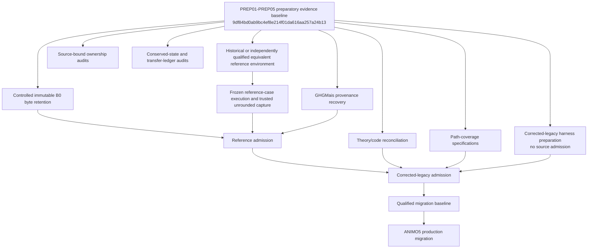

# ANIMO-RG01 serial and parallel DAG

This DAG controls work after the PREP01-PREP05 evidence baseline. It is not authorization for ANIMO5 production migration.

## Serial gates

The following order is fail-closed:

1. establish controlled immutable B0 retention;
2. qualify a historical native or independently justified equivalent reference environment;
3. execute at least the admitted frozen reference case and capture trusted unrounded behaviour;
4. perform explicit reference admission;
5. qualify and admit corrected-legacy changes individually and in admitted composition;
6. establish the qualified migration baseline;
7. only then allow ANIMO5 production process migration.

A downstream gate cannot be satisfied by a diagnostic GNU run, by a preparatory source audit, by small observed numerical impact, or by a machine-readable status edit alone.

## Parallel work currently allowed

The following may proceed from the stabilized preparatory baseline when ownership is disjoint:

- source-bound ownership and mutation audits;
- PREP06 conserved-state and transfer-ledger audit;
- theory/code/documentation reconciliation;
- path-coverage specifications and synthetic coverage design;
- corrected-legacy harness preparation without modifying or admitting frozen source;
- GHGMais source/testcase provenance recovery;
- Status A/AA evidence-gap maintenance.

Parallel work must not modify shared production semantics. Findings that imply a physics, numerical-policy, canonical-state, transaction, mass-accounting or exchange-contract decision stop at evidence/contract preparation until a serial owner admits the change.
